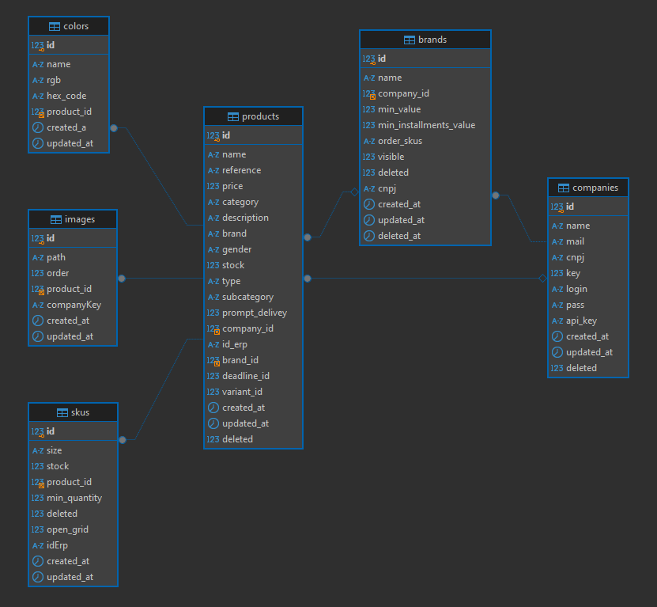

# Teste ECatalogos

### Estrutura do banco de dados



### Rodando com Docker

<details>
  <summary><b>Requisitos:</b></summary><br>
  
  - Ter o `Git` instalado em sua máquina;
  - Ter o `docker` instalado e ativado em sua máquina.
  
</details>

<details>
  <summary><b>Clonar</b></summary><br>

Para clonar o repositório usando HTTPS:

```
git clone https://github.com/HiagoBriano/eCatalogos.git
```

Para clonar usando SSH:

```
git clone git@github.com:HiagoBriano/eCatalogos.git
```

</details>

<details>
  <summary><b>Vamos lá</b></summary><br>

Entre na pasta principal:

```
cd eCatalogos
```

Inicie o docker com o comando:

```
docker-compose up -d
```

Abra o link abaixo no navegador de sua preferencia:

```
http://localhost:3000/
```

</details>

</details>

### Populando o banco de dados

Para popular o banco de dados execute o comando abaixo no terminal

```
npm run seed
```

- Precisa estar na pasta `API`

## Autor

Linkedin - [Hiago Briano](https://www.linkedin.com/in/hiago-briano/)

Email - hiago.artist@hotmail.com
